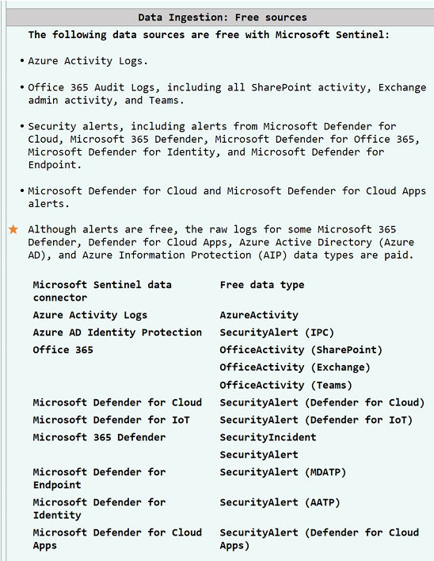

# Sentinel Cost Optimization Guide

## Sentinel Free trial

- try sentinel for 31 days for free.
-  new log analytics workspace (less than 3 days old) can ingest upto 10GB/day of log data for first 31 days at no extra cost.
- Log analytics data ingestion and sentinel charges are waived during 31 day trial period. Free trial is available 

- You can try Microsoft Sentinel for 31 days for free. 
- New log analytics workspaces (less than 3 days old) can ingest up to 10GB/day of log data for the first 31-days at no extra cost. 
- Log Analytics data ingestion and Sentinel charges are waived during the 31-day trial period. (Free trial available for up to 20 workspaces per Azure tenant).
- Existing workspaces can also enable Microsoft Sentinel at no extra cost. However, only Microsoft Sentinel charges will be waived during the 31-day trial period. 
- Usage beyond these limits will be charged as per standard Microsoft Sentinel pricing. 

**Available Benefits:**
Microsoft Sentinel benefit for Microsoft 365 E5, AS, F5, and GS customers. Offer of up to 5MB per user per day of data ingestion into Sentinel.

## Data Ingestion: Free sources 

The following data sources are free with Microsoft Sentinel: 
- Azure Activity Logs
- Office 365 Audit Logs, including all Sharepoint activity, Exchange admin activity, and Teams.
- Security alerts, including alerts from Microsoft Defender for Cloud, Microsoft 365 Defender, Microsoft Defender for Office 365, Microsoft Defender for Identity, and Microsoft Defender for Endpoint.
- Microsoft Defender for Cloud and Microsoft Defender for Cloud Apps alerts . 

**Although alerts are free, the raw logs for some Microsoft 365 Defender, Defender for cloud Apps, Azure Active Directory (Azure AD), and Azure Information protection (Alp) data types are paid.**

Microsoft Sentinel Data connectors and Free data types generate table format.

## Sentinel: Integration with Azure Services 
Sentinel integrates with many other Azure services. 

Take into consideration that some of these services may have extra charges: 

- Automation-Logic Apps 
- Notebooks 
- BYOML 
- Azure functions. 

## Logs: Understand data ingestion 

What do you need to pay for when using Microsoft Sentinel? 

1. Azure Monitor data ingestion: Analytics logs and basic logs 
2. Microsoft Sentinel data analytics (compute): Analytics logs and basic logs 
3. Data retention 
4. Data archive 
5. Basic logs queries 

**How are you charged?** 

*Analytic loqs: there are 2 billinq options available.* 

- Pay-As-You-Go: default model, based on volume stored. Also optional for data kept beyond 9e days. 
- Commitment tiers: the way to go as it will give more predictable costs. Up to 65% discount compared to Pay-AS-you-Go. 
- Considerations: you can increase commitment tiers anytime, and decrease every 31 days . 

*Basic logs: reduced price and charged at a flat rate per GB.*

Recommendation - only use Basic logs if: 

1. You don't require more than 8 days of data retention for the table 
2. Only require basic queries of the data using a limited version of KQL. 
3. The cost savings for data ingestion exceed the expected cost for any expected queries. 
4. The table supports basic logs. 

**CEF ingestion costs:**

- you can use CEF to bring in valuable security information from various sources to your Microsoft Sentinel workspace. CEF logs land in the CommonSecurityLog table in Microsoft Sentinel, which includes all the standard up-to-date CEF fields. 

- Costs that might accrue after resource deletion: removing Microsoft Sentinel, doesn't remove the Log Analytics workspace Microsoft Sentinel was deployed on, or any separate charges that workspace might be incurring. 

- Avoid bill shock - don't just turn all data connectors at once, ensure there is a solution design in place and start connecting your resources in an organized manner. Always remember to SET your daily ingestion caps and ONLY ingest data relevant to your service offering and customer needs.

## Data retention & Storage options 
Bear in mind that after enabling Sentinel on a Log Analytics workspace you can: 

- Retain all ingested data into that workspace at no charge for 90 days. Going beyond 90 days will be charged. 
- Different retention settings for individuals data types can specified. 
- There is also an option to enable long-term retention for your data and have access to historical logs by enabling archived logs. 

*How does retention and archiving work?* 

- Each workspace has a default retention policy that is applied to all tables. However, you can set different retention policy on 
individual tables. 
- During the interactive retention period, data is available for monitoring, troubleshooting, and analytics. When you no longer use the 
logs, but still need to keep the data for compliance or occasional investigation, archive the logs to save costs. 
- Archived data stays in the same table, alongside the data that's available for interactive queries. When you set a total retention period that's longer than the interactive retention period, Log Analytics automatically archives the relevant data immediately at the end of the retention period. 

- If you change the archive settings on a table with existing data, the relevant data in the table is also affected immediately. For example, you might have an existing table with 30 days of interactive retention and no archive period. You decide to change the retention policy to eight days of interactive retention and one year total retention. Log Analytics immediately archives any data 
that's older than eight days. 

**Storage options:**

1. Retention and Archive policies in Log Analytics Workspaces - recommended for users that want to query the data on occasion 
2. Azure Data Explorer (ADX) 
3. Exporting Data to an Azure querying needs 
4. Storage account export via account set in a different 

*Good to know:* 

**Purge retained data**
- recommended for users who need to frequently query the data Storage Account - recommended for users who rarely need to perform queries on the data or have specific 
Logic Apps - 
recommended for users who rarely need to perform queries on the data and have their storage 
region than their log analytics workspace 
Purge retained data: If you set the data retention policy to 30 days, you can purge older data immediately by using 
the immediatepurgeDataOn3ØDays parameter in Azure Resource Manager. The purge functionality is useful when you need to remove personal 
data immediately. The immediate purge functionality isn't available through the Azure portal. 

**Tables with unique retention policies:** 
By default, two data types, Usage and AzureActivity, keep data for at least 90 days at no charge. 
When you increase the workspace retention to more than 9e days, you also increase the retention of these data types. You'll be charged for 
retaining this data beyond the 90-day period. These tables are also free from data ingestion charges. 
*Tables related to Application Insights resources also keep data for 90 days at no charge.

