# Vulnerability management - Enterprise frameworks and important URLs

🔎 Enterprise Vulnerability Intelligence & Patch Intelligence Framework
(Aligned to VAPT, CVE/NVD, Vendor Advisories, and Azure VM Operations)

This framework integrates:

Public vulnerability intelligence sources

Vendor patch repositories

CVSS scoring models

Penetration testing intelligence

Enterprise Azure VM vulnerability operations

1️⃣ Enterprise Vulnerability Intelligence Architecture
Image

Image

Image

Image

Intelligence Flow
Public CVE Feeds          ↓  NVD Enrichment (CVSS, CPE)          ↓  Vendor Advisory Correlation          ↓  Internal Asset Mapping          ↓  Risk Scoring Engine          ↓  Patch Deployment / Mitigation          ↓  Verification & Reporting  
2️⃣ Authoritative Vulnerability Intelligence Sources
🌐 Global Vulnerability Databases
1️⃣ CVE – Common Vulnerabilities and Exposures
Managed by MITRE.

Assigns CVE-ID format: CVE-YYYY-NNNN

Acts as global identifier

Enables cross-vendor correlation

Used for:

Tracking vulnerability lifecycle

Mapping to internal asset inventory

Threat intelligence enrichment

2️⃣ NVD – National Vulnerability Database
Provides:

CVSS v3.x scoring

CPE (Common Platform Enumeration)

CWE weakness mapping

Exploit references

Enterprise Use:

Automated severity classification

Risk scoring automation

Compliance reporting

3️⃣ FIRST – CVSS Framework
Defines:

Base Score

Temporal Score

Environmental Score

Enterprise Use:

Contextual risk prioritization

Business-adjusted severity calculation

SLA mapping

3️⃣ Vendor-Specific Patch Intelligence
🪟 Microsoft Ecosystem
Microsoft Security Response Center (MSRC)
Provides:

Patch Tuesday advisories

Zero-day disclosures

Exploit status

Microsoft Update Catalog
Used for:

Manual patch download

Offline patching

Emergency patch deployment

Microsoft Product Lifecycle
Critical for:

End-of-life detection

Unsupported OS identification

Migration prioritization

🐧 Red Hat
Security advisories (RHSA)

Bugzilla vulnerability tracking

Errata patch downloads

Enterprise Action:

Automate yum/dnf updates

Correlate RHSA with CVE

Monitor kernel-level vulnerabilities

🐧 Ubuntu
Security notices (USN)

Patch repositories

APT-based update tracking

🐧 CentOS (EOL Notice)
CentOS development ended December 2021.

Enterprise Action:

Identify unsupported systems

Migrate to:

RHEL

Rocky Linux

AlmaLinux

Block unsupported OS from production deployment

4️⃣ VAPT Integration into Vulnerability Management
The references provided emphasize:

VAPT methodology

Nmap scanning

NSE scripting

Port-based attack mapping

Network penetration testing

🔍 VAPT vs Vulnerability Management
Aspect	Vulnerability Management	VAPT
Frequency	Continuous	Periodic
Objective	Risk reduction	Exploit validation
Scope	Full environment	Targeted testing
Output	Risk dashboard	Exploit report
5️⃣ Nmap & NSE in Enterprise VM Security
What Nmap Adds
Open port detection

Service version detection

SSL/TLS weakness detection

Misconfiguration discovery

Example Enterprise Use Cases:

Detect exposed RDP (3389)

Detect open SSH (22)

Detect outdated SSL cipher suites

Identify weak DH parameters

SSL DH Weak Parameter Detection
Weak Diffie-Hellman parameters enable:

Logjam attack

Downgrade attacks

Weak encryption negotiation

Enterprise Response:

Disable weak cipher suites

Enforce TLS 1.2+

Regenerate strong DH params

Rescan using automated scripts

6️⃣ Vulnerable Ports in Enterprise Azure Environments
Image

Image

Image

Image

High-Risk Ports
Port	Service	Risk
22	SSH	Brute force
3389	RDP	Ransomware entry
445	SMB	Lateral movement
1433	MSSQL	Data exfiltration
80/443	Web	Web attacks
21	FTP	Credential exposure
Enterprise Controls:

NSG restrictions

Just-in-time VM access

Bastion host usage

Zero Trust access

7️⃣ Enterprise Patch Intelligence Workflow
Step 1 – CVE Monitoring
Automated feed ingestion

Threat intelligence correlation

KEV (Known Exploited Vulnerabilities) mapping

Step 2 – Asset Mapping
Match CVE → CPE → Installed software

Identify impacted Azure VMs

Step 3 – Risk Scoring
Adjusted Risk Score =  CVSS + Internet Exposure + Business Criticality  + Exploit Availability + Compliance Impact  
Step 4 – Patch Retrieval
Microsoft Update Catalog

RHSA advisory

APT/YUM repositories

Step 5 – Testing
Deploy in staging

Validate service integrity

Performance testing

Step 6 – Production Rollout
Phased deployment

Change approval (CAB)

Post-deployment validation scan

8️⃣ Enterprise Vulnerability Prioritization Model (Advanced)
Priority Boost Conditions
Actively exploited

Internet-facing VM

Privileged service account exposure

Domain controller vulnerability

Data sensitivity impact

9️⃣ Integration with Azure Security Stack
Enterprise Integration:

Defender for Cloud → vulnerability detection

Azure Policy → baseline enforcement

Azure Update Manager → patch automation

Microsoft Sentinel → exploitation monitoring

Log Analytics → trend analysis

🔟 Reporting & Executive Dashboard Metrics
KPI	Target
Critical CVEs older than 7 days	0
Exploitable internet-facing systems	0
Unsupported OS	0
Patch compliance	> 95%
Mean Time to Remediate	< 14 days
1️⃣1️⃣ Enterprise Maturity Model (Vulnerability Intelligence)
Level	Description
Level 1	Manual CVE lookup
Level 2	Automated scanning
Level 3	CVE-to-asset correlation
Level 4	Threat intel enrichment
Level 5	Predictive risk analytics
1️⃣2️⃣ Key Takeaways
An enterprise-grade vulnerability management program must integrate:

CVE/NVD intelligence

Vendor patch advisories

CVSS scoring

VAPT validation

Azure-native automation

Continuous monitoring

Business-aligned risk scoring

It is not just about scanning — it is about:

Intelligence correlation

Risk-based action

Automation

Verification

Continuous improvement

If you want, I can now provide:

📊 300+ Enterprise Vulnerability Control Checklist

📑 Complete VAPT + VM Unified Governance Framework

🔥 Azure Attack Path Exploitation Simulation Flow

🏢 SOC Operating Model for Vulnerability Intelligence

📈 Executive Vulnerability Risk Dashboard Template

🌐 Enterprise Vulnerability Management – Authoritative Reference URLs
(On-Premises + Cloud | Intelligence, Patching, Scanning, Compliance & Threat Feeds)

Below is a curated enterprise-grade reference library covering:

Global vulnerability intelligence

CVSS scoring & exploit tracking

Vendor patch portals (Windows & Linux)

Cloud provider security centers

Network & VAPT tools

Threat intelligence feeds

Compliance mappings

1️⃣ Global Vulnerability Intelligence Sources
These are mandatory references for any enterprise vulnerability program.

Resource	Purpose	URL
CVE (MITRE)	Unique vulnerability identifiers	https://cve.mitre.org
NVD (NIST)	CVSS scores, CPE mapping	https://nvd.nist.gov
FIRST CVSS	Official CVSS framework documentation	https://www.first.org/cvss
CISA KEV Catalog	Known Exploited Vulnerabilities list	https://www.cisa.gov/known-exploited-vulnerabilities-catalog
Exploit-DB	Public exploit database	https://www.exploit-db.com
MITRE ATT&CK	Adversary tactics & techniques	https://attack.mitre.org
OWASP Top 10	Web application risks	https://owasp.org/www-project-top-ten
2️⃣ Vendor Patch & Security Advisory Portals
🪟 Microsoft Ecosystem (On-Prem + Azure)
Resource	Purpose	URL
Microsoft Security Response Center (MSRC)	Security advisories	https://www.microsoft.com/msrc
Microsoft Update Catalog	Manual patch downloads	https://www.catalog.update.microsoft.com
Windows Lifecycle (EOL)	Support timelines	https://learn.microsoft.com/lifecycle
Defender Vulnerability Mgmt	Enterprise VM scanning	https://learn.microsoft.com/microsoft-365/security/defender-vulnerability-management
🐧 Red Hat Enterprise Linux
Resource	Purpose	URL
Red Hat Security Advisories (RHSA)	Patch advisories	https://access.redhat.com/security/security-updates
Red Hat Bugzilla	Vulnerability tracking	https://bugzilla.redhat.com
Red Hat CVE Database	CVE search	https://access.redhat.com/security/cve
🐧 Ubuntu
Resource	Purpose	URL
Ubuntu Security Notices	Patch advisories	https://ubuntu.com/security/notices
Ubuntu CVE Tracker	CVE mapping	https://people.canonical.com/~ubuntu-security/cve/
🐧 Rocky / Alma Linux
Resource	URL
Rocky Linux Security	https://rockylinux.org/security
AlmaLinux Errata	https://errata.almalinux.org
🐧 CentOS (Legacy Warning)
CentOS 8 reached EOL.
Migration recommended.

Reference:
https://www.centos.org

3️⃣ Cloud Provider Vulnerability Management Portals
☁ Microsoft Azure
Image

Image

Image

Image

Resource	Purpose	URL
Microsoft Defender for Cloud	Cloud VM vulnerability scanning	https://learn.microsoft.com/azure/defender-for-cloud
Azure Update Manager	Patch automation	https://learn.microsoft.com/azure/update-manager
Azure Policy	Compliance enforcement	https://learn.microsoft.com/azure/governance/policy
Azure Security Benchmark	Azure baseline controls	https://learn.microsoft.com/security/benchmark/azure
☁ AWS
Resource	Purpose	URL
AWS Inspector	VM vulnerability scanning	https://aws.amazon.com/inspector
AWS Security Bulletins	Patch advisories	https://aws.amazon.com/security/security-bulletins
AWS Security Hub	Compliance & posture	https://aws.amazon.com/security-hub
☁ Google Cloud
Resource	Purpose	URL
GCP Security Command Center	Cloud posture & vulnerabilities	https://cloud.google.com/security-command-center
GCP Security Bulletins	Advisories	https://cloud.google.com/support/bulletins
4️⃣ Enterprise Vulnerability Scanning & VAPT Tools
🔍 Network & Port Scanning
Tool	URL
Nmap	https://nmap.org
Nmap NSE Scripts	https://nmap.org/nsedoc
OpenVAS (Greenbone)	https://www.greenbone.net
Nessus	https://www.tenable.com/products/nessus
Rapid7 InsightVM	https://www.rapid7.com/products/insightvm
Qualys VMDR	https://www.qualys.com
🔐 SSL/TLS Testing
Tool	URL
SSL Labs Test	https://www.ssllabs.com/ssltest
testssl.sh	https://github.com/drwetter/testssl.sh
5️⃣ Threat Intelligence & Exploit Monitoring
Resource	Purpose	URL
CISA Alerts	Active exploitation alerts	https://www.cisa.gov/news-events
US-CERT	Vulnerability alerts	https://www.cisa.gov/uscert
Zero Day Initiative	0-day tracking	https://www.zerodayinitiative.com
VirusTotal	Malware intelligence	https://www.virustotal.com
6️⃣ Compliance & Regulatory Mapping References
Standard	URL
NIST CSF	https://www.nist.gov/cyberframework
NIST 800-53	https://csrc.nist.gov/publications/detail/sp/800-53/rev-5/final
ISO 27001	https://www.iso.org/isoiec-27001-information-security.html
PCI DSS	https://www.pcisecuritystandards.org
HIPAA Security Rule	https://www.hhs.gov/hipaa
7️⃣ Enterprise On-Prem Patch Management Tools
Tool	URL
Microsoft WSUS	https://learn.microsoft.com/windows-server/administration/windows-server-update-services
SCCM / MECM	https://learn.microsoft.com/mem/configmgr
Ivanti Patch Mgmt	https://www.ivanti.com
ManageEngine Patch Manager	https://www.manageengine.com/patch-management
8️⃣ Attack Surface Monitoring & Exposure Management
Tool	URL
Shodan	https://www.shodan.io
Censys	https://censys.io
SecurityTrails	https://securitytrails.com
9️⃣ Enterprise Knowledge & VAPT Learning Resources
Resource	URL
OWASP Testing Guide	https://owasp.org/www-project-web-security-testing-guide
Nmap Book	https://nmap.org/book
Network Pen Testing Guide	https://infosecchamp.com/network-penetration-testing
VAPT Guide	https://pixelstreet.in/blog/vapt-guide
🔟 Recommended Enterprise Integration Strategy
For hybrid (On-Prem + Azure) environments:

Use CVE/NVD for global tracking.

Integrate vendor advisories into patch workflow.

Enable cloud-native scanners (Defender, Inspector).

Use on-prem tools (WSUS/SCCM) for legacy servers.

Subscribe to CISA KEV for priority remediation.

Track unsupported OS versions continuously.

Automate reporting for compliance evidence.

📌 Final Recommendation for Enterprise Teams
Maintain a central Vulnerability Intelligence Portal internally that:

Pulls CVE/NVD feeds

Correlates vendor patches

Maps to CMDB

Integrates cloud + on-prem assets

Tracks SLA compliance

Generates board-level dashboards

If you'd like, I can next provide:

📊 Hybrid (On-Prem + Azure) Vulnerability Governance Framework

📑 Unified VM + VAPT Enterprise SOP

🔥 350+ Control Audit Checklist

🏢 SOC Workflow for Exploit Monitoring

📈 Executive Dashboard Metrics Model (Excel Structure)

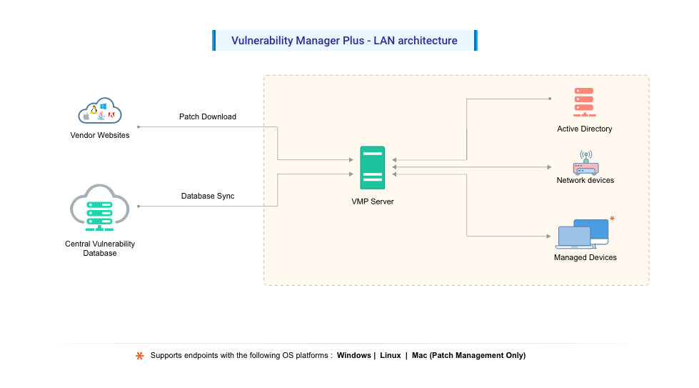

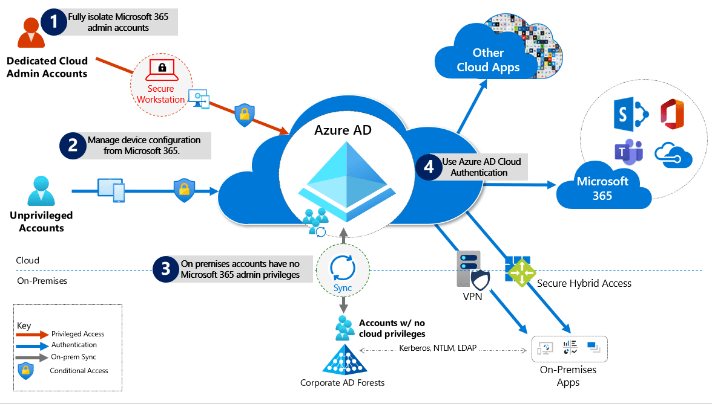

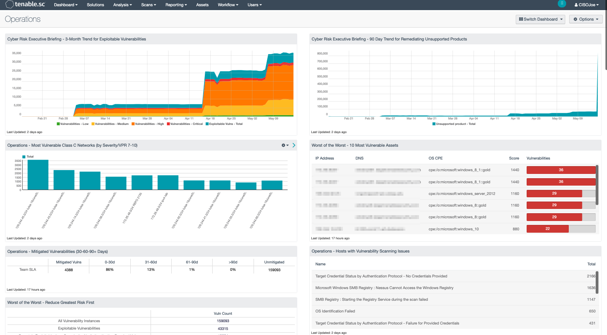

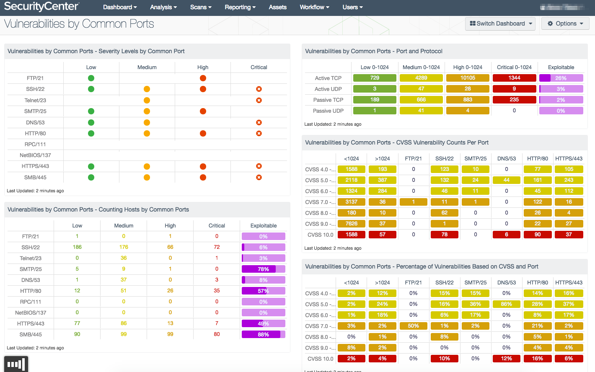

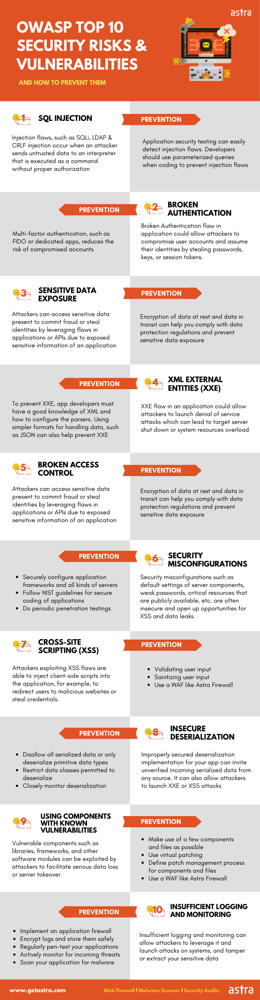

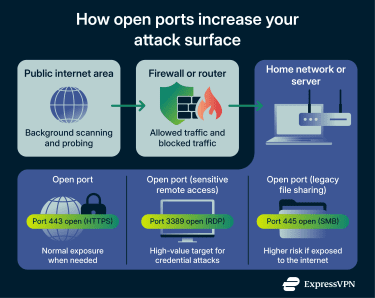

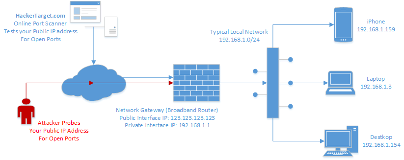

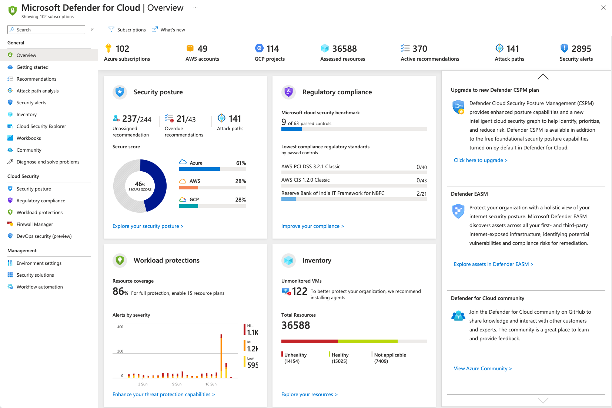

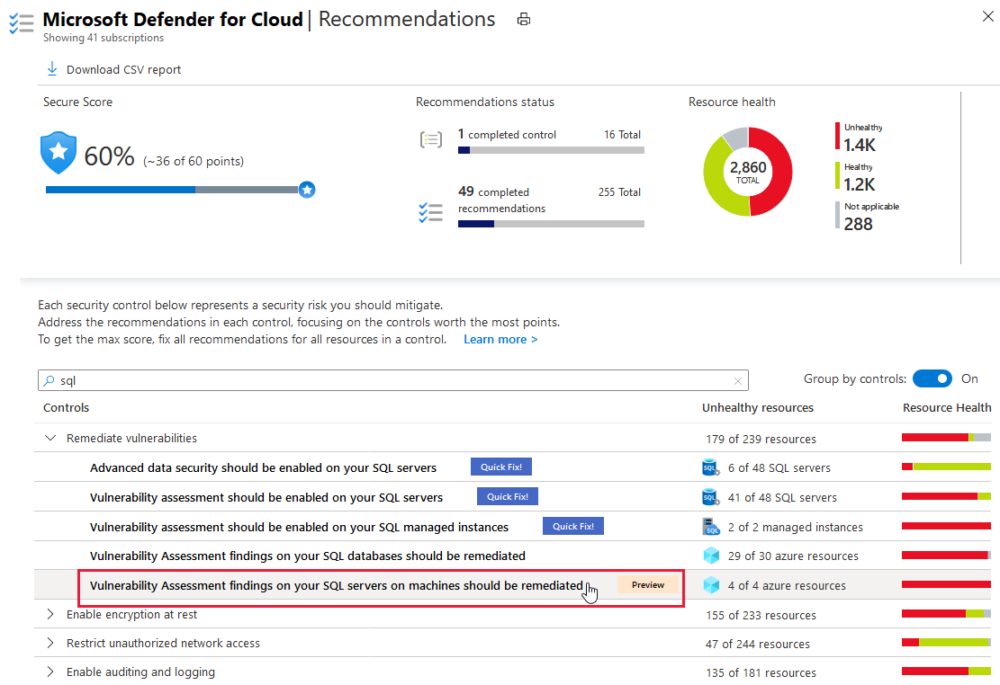

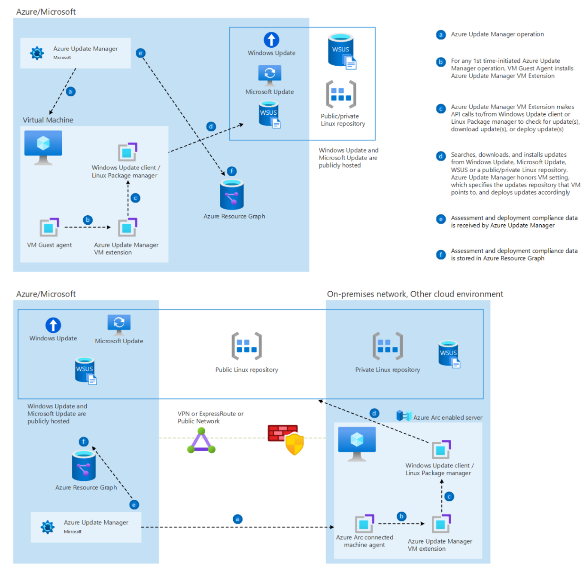

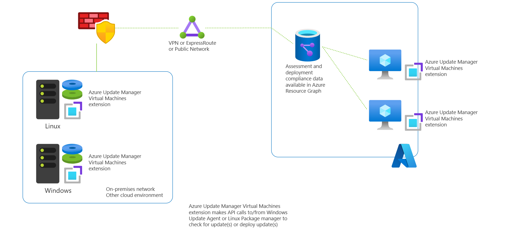

